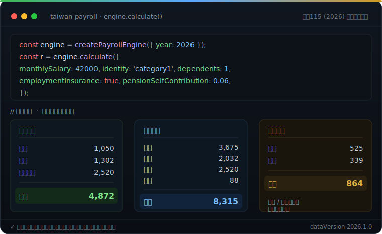

# taiwan-payroll

[](https://www.npmjs.com/package/taiwan-payroll)
[](https://pypi.org/project/taiwan-payroll/)
[](#license)
[](https://smithery.ai/servers/supra126/taiwan-payroll)

開源的台灣勞健保勞退法定費用計算引擎。輸入薪資與身份，算出勞保（含就保）、健保、勞退、職災與二代健保補充保費的各方負擔——並涵蓋薪資所得扣繳、月中到職／離職破月、健保補充保費申報媒體檔，以及勞保老年給付試算。

<p align="center">
  
  <br><sub>示意：在支援 MCP 的 AI 助理（Claude / Cursor 等）中呼叫 taiwan-payroll</sub>
</p>

<p align="center">
  
</p>

- 🧮 **線上試算**：<https://taiwan-payroll.vercel.app>（免安裝，瀏覽器直接算）
- 🔌 **三種介面**：TypeScript（npm）、Python（PyPI，純 stdlib）、MCP server（給 AI 助理呼叫）
- 📑 **官方對證**：級距表與費率逐級取自主管機關公告，計算結果對官方範例黃金向量逐位元驗證
- 🔁 **跨語言一致**：TS 與 Python 讀同一份 `data/`、跑同一套 `testdata/`，結果逐位元相同
- 📦 **零執行期依賴**：core 不帶任何 runtime 套件

> **定位是「計算引擎」而非「法遵保證」。** 內建民國 113–115（2024–2026）年度官方參數。

## 安裝

```bash
npm install taiwan-payroll      # TypeScript / Node
pip install taiwan-payroll      # Python
```

## 快速上手

```ts
import { createPayrollEngine } from 'taiwan-payroll';

const engine = createPayrollEngine({ year: 2026 });
const r = engine.calculate({
  monthlySalary: 42000,
  identity: 'category1',
  dependents: 1,
  employmentInsurance: true,
  pensionSelfContribution: 0.06,
});

console.log(r.employee); // { labor: 1050, health: 1302, pensionSelf: 2520, total: 4872 }
console.log(r.employer.occupational); // 職災雇主負擔
```

## 二代健保補充保費與破月計算

```ts
// 補充保費（六類所得：bonus/parttime/professional/dividend/interest/rent）
engine.calculateSupplementary({ type: 'bonus', amount: 200000, monthlyInsuredSalary: 42000 });
// → { type: 'bonus', chargeable: 32000, rate: '0.0211', premium: 675 }

// 月中到職／離職（勞保/職保/勞退按日；健保採官方「月底歸屬」原則）
engine.calculateProrated({ monthlySalary: 29500, startDate: '2026-03-08' });
// → { ..., days: { insured: 23 }, healthCharged: true }
```

> **健保破月採「月底歸屬原則」**：以月底所屬投保單位計收整月——到職當月計整月、離職當月不計。此為健保署實務規則（非按日、與 15 日分水嶺無關）。

## 申報媒體檔（健保補充保費）

由申報資料產生健保署「補充保險費明細申報檔」（CSV／Big5），涵蓋 6 類所得：獎金(62)、兼職薪資(63)、執行業務(65)、股利(66)、利息(67)、租金(68)。每個產生器皆以健保署官方範例**逐位元驗證**，TS 與 Python 結果一致。

```ts
import { generateSupplementaryBonusFiling } from 'taiwan-payroll';

const { filename, content } = generateSupplementaryBonusFiling({
  year: 2026,
  filingDate: '20260901', // 用於檔名
  unit: { taxId: '11111111', name: '甲公司', phone: '0227065866', email: 'a@b.tw', contactName: '王小明' },
  records: [
    { action: 'I', payDate: '20260615', payeeId: 'A123456789', payeeName: '李四',
      bonusAmount: 50000, insuredSalary: 31800, ytdBonusCumulative: 150000, unitCode: '123456789' },
  ],
});
// filename: 'DPR111111111150901001.csv'
// content : Unicode 字串；檔案實際為 Big5，存檔時請以 Big5 編碼寫出。
```

- 獎金/兼職/執行業務/利息/租金：逐列補充保費由引擎計算。股利(`generateSupplementaryDividendFiling`)因含股票股利／雇主扣除等情形，逐列保費由呼叫端提供（另附便利函式 `calcDividendPremium`）。
- 輸出為「資料檔」供以官方入口上傳。**Big5 編碼**：TS 由呼叫端編碼，Python 提供 `to_big5_bytes()`（core 維持零依賴）。
- API 詳見文件站 `/docs/api`。

## 勞保老年給付試算

依勞保局官方公式試算三種老年給付（皆對官方數值/公式驗證、TS≡Python）：

```ts
import { calcOldAgePension, calcOldAgeLumpSum, calcOldAgeSinglePayment, getYearData } from 'taiwan-payroll';
const d = getYearData(2026);
calcOldAgePension(d, { avgInsuredSalary: 32000, years: 35, months: 6 });     // 月領年金（擇優兩式，可提前/延後）
calcOldAgeLumpSum(d, { avgInsuredSalary: 30000, years: 10 });                // 老年一次金
calcOldAgeSinglePayment(d, { avgInsuredSalary: 30000, preSixtyYears: 20 });  // 一次請領（舊制基數）
```

- **老年年金**：擇優兩式（`平均×年資×0.775%+3000` vs `×1.55%`），提前/延後 `claimOffsetMonths`（±4%/年、上限 ±5 年（±20%））；附 `averageHighestInsuredSalary`、`statutoryClaimAge`。
- **老年一次金**：年資每滿 1 年發 1 個月，逾 60 歲後年資最多 5 年。
- **一次請領**：基數制（前 15 年每年 1 基數、超過部分每年 2 基數、前 60 上限 45、合併上限 50），平均採退保前 36 個月。
- 試算僅供參考，實際以勞保局核定為準。

## 架構

- `data/{year}.json` — 單一事實來源，年度法規參數（級距表、費率），以 JSON Schema 驗證。
- `testdata/` — 語言無關的黃金測試向量（官方案例，含 `source` 出處），是跨語言行為一致性的根基。
- `packages/core` — 零執行期依賴的 TypeScript 引擎。

## 其他語言與介面

- **Python**：`pip install taiwan-payroll`，純 stdlib、API 對應 TS 版（[PyPI](https://pypi.org/project/taiwan-payroll/)）。
- **MCP server**：讓 Claude 等 AI 助理直接呼叫試算。遠端免安裝端點 `https://taiwan-payroll.simoko.workers.dev/mcp`（Streamable HTTP），或本地 `npx taiwan-payroll-mcp`（stdio，[npm](https://www.npmjs.com/package/taiwan-payroll-mcp)）。
  - 上架於官方 MCP Registry（`io.github.supra126/taiwan-payroll`）與 [Smithery](https://smithery.ai/servers/supra126/taiwan-payroll)（一鍵安裝）。
- **線上計算機與完整 API**：<https://taiwan-payroll.vercel.app>

## 資料來源（2026 / 民國115年）

| 項目 | 主管機關 | 文號 |
|---|---|---|
| 勞保投保薪資分級表（11級，上限45,800） | 勞動部勞保局 | 勞動保2字第1140091863號令 |
| 勞退月提繳分級表（62級，上限150,000） | 勞動部勞保局 | 勞動福3字第1140153598號令 |
| 職災投保薪資分級表（21級，上限72,800） | 勞動部勞保局 | 職災保險法§17 |
| 健保投保金額分級表（58級，上限313,000） | 衛福部健保署 | 衛部保字第1140153424號令 |

費率：勞保 12.5%（含就保 1%）、健保 5.17%、勞退雇主 6%、職災平均 0.21%、二代健保補充保費 2.11%。

目前內建民國 **113／114／115（2024／2025／2026）** 三個年度，各年度的分級表與文號見 `data/{year}.json` 的 `sources`；以 `createPayrollEngine({ year })` 指定，可用年度由 `getAvailableYears()` 取得。

## 開發

```bash
pnpm install
pnpm validate:data   # 驗證 data schema、級距連續性、向量格式
pnpm -r test         # 跑全部黃金測試向量
pnpm typecheck
```

## 免責聲明

本套件依公開法規與主管機關公告實作，計算結果僅供參考，實際應繳金額以勞保局、健保署核發之繳款單為準。本套件不構成法律或會計建議。

## License

MIT
